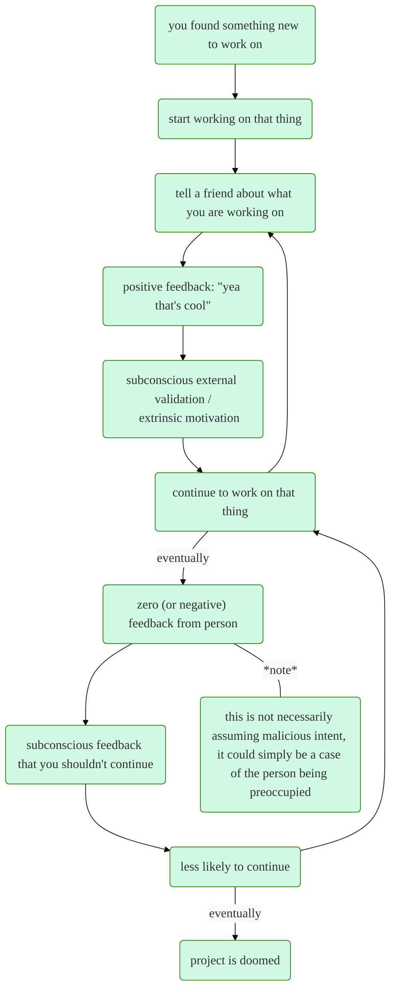
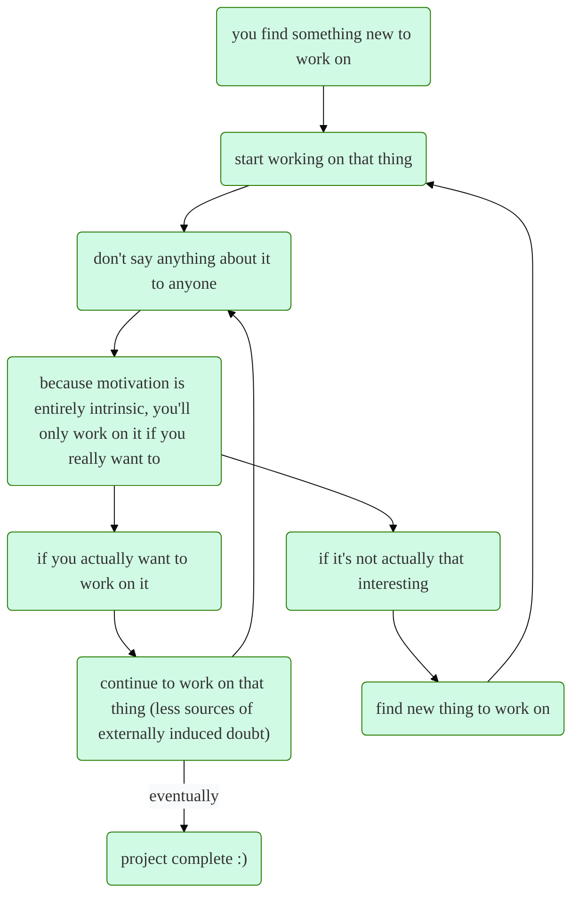

<!-- LLM PROMPT: This document contains all notes from an Emanote notebook.
Each note is separated by '===' delimiters and includes metadata headers.
- Source: The original file path in the notebook
- URL: The full URL where this note can be accessed
- Title: The note's title
- Wikilinks: All possible ways to reference this note using [[wikilink]] syntax

When referencing notes, you can use any of the wikilinks provided.
The base URL is: 
-->

<!-- Source: about.md -->
<!-- URL: /about -->
<!-- Title: about -->
<!-- Wikilinks: [[about]] -->

---
slug: about
order: 1
---

# about

_last updated: january 12, 2026_

hello I'm Michael, aka Broccoli - I'm a mechanical engineer who enjoys doing things that get the brain juices flowing :slightly_smiling_face:


 *broccoccoccoli*


## things I currently spend my free time on
*ordered by avg time spent per week, high to low*

- games
    - apex
    - fortnite (highkey underrated for being a "kids" game but it's actually really fun)
    - league
    - dreaming about the riot mmo
- doomscrolling
- going to the gym to channel my inner caveman
- project ___ [^1] <!--bp/sts-->
- ---[^1] <!--vl-->
- ---[^1] <!--ct-->
- frc mentoring (on hold)
- ???


## peak ranks
*if you read this far then you might be slightly interested in this info*
- [apex legends master](images/apexrank.png) season 10[^2] / 11 / 12[^2] / 13[^2] / [26](images/s26.webp) / [27 (swapped to controller)](images/s27.webp) 
- teamfight tactics [grandmaster set 13](images/tftrank13.png) (rank **\#474** NA, 357 LP peak) | [grandmaster set 7.5](images/tftrank.png) (476 LP peak) | master set 9 / 6.5 / 6 
- [fortnite zb unreal rank c7s1](images/unreal_c7s1.webp) (this felt too easy to be impressive but might as well put it on the record)
- [osu rank \#7623](https://osu.ppy.sh/users/5870537) 
- [league of legends diamond 3 season 9](https://www.op.gg/summoners/na/Broccoli-veg)

&nbsp;


[^1]: [[2023-02-05-the-n2nbl-strategy|this post]] explains why this activity is listed, but not specified
[^2]: soloqueue only

===

<!-- Source: apex.md -->
<!-- URL: /apex -->
<!-- Title: apex -->
<!-- Wikilinks: [[apex]] -->

---
order: 2
---

# apex

i made some stuff about apex legends

notes in folder
: [[most-recent-cliptage|most recent cliptage]]
: [[fundamentals|fundamentals series]]


===

<!-- Source: apex/fundamentals.md -->
<!-- URL: /apex/fundamentals -->
<!-- Title: fundamentals -->
<!-- Wikilinks: [[apex/fundamentals]], [[fundamentals]] -->

---
order: 2
---

# fundamentals

for those who want to improve, but are unsure of what to focus on

if you have any questions about these notes, you can always ask me 🙂

1. [[the-basics|the basics]]
2. [[speed]]
3. [[damage-delta|damage delta]]
4. *coming eventually* <!-- [[space]] -->
5. *coming eventually* <!-- [[intro-to-macro|intro to macro]] -->


===

<!-- Source: apex/fundamentals/damage-delta.md -->
<!-- URL: /apex/fundamentals/damage-delta -->
<!-- Title: damage delta -->
<!-- Wikilinks: [[apex/fundamentals/damage-delta]], [[fundamentals/damage-delta]], [[damage-delta]] -->

---
date: "2023-03-05"
slug: apex/fundamentals/damage-delta
tags: [games]
order: 3
---

# damage delta

_last updated: march 10, 2023_

so now that we know that getting faster at apex is the key to improvement, how exactly do we speed up fights? To answer this, let's look at the concept that I like to call the "damage delta":

## what is the damage delta?

the "damage delta" is the difference between a player's **damage output** and their **damage taken** - I like to view it this way because apex is not as simple as putting out a ton of damage to get kills, but to get good you *also* have to focus on **minimizing the damage your are taking**.

<center></center>

## why do we care about it?

the most important reason why maximizing the damage delta is important because it enables an **artifical numbers advantage**. What this means is when someone gets their shield cracked and is forced to heal, they are essentially **out of the game** for the next few seconds *(see health item table below)*. For example, dealing 140 damage to someone with a purple shield means they will have to spend 10 to 27+ seconds doing nothing but healing. 

this may seem obvious when said out loud, but timing is a huge part of this game. **Newer players often don't understand the importance of making a move right after they deal a lot of damage.** As soon as someone gets chunked for a lot of health, the clock starts ticking, and you have **a limited time to respond** before they are back to full. Remember, a shield battery only takes 5 seconds to pop.

however, you don't necessarily have to go completely monkey mode when you chunk someone. If you deal a lot of damage from range, you can use this window to **reposition** to a superior spot and angle out your opponent. It's only when you deal a lot of damage **up close**, that you should use the window to slide in and get the kill.

<center></center>
&nbsp;

it's important to remember that the goal is to also **minimize** the damage taken. If you peek and deal 140 damage but also take 90 damage, you face the decision of either pushing at low hp, or mirroring their healing and missing that timing window.

another reason why you should be minimizing the damage taken is because while you can shield swap to instantly get your **shields** to full health, you cannot instantly heal your **flesh health**. In a fight, unless you are **100% certain** that you are not going to get third partied, you should **always assume** that you will get third partied. We give ourselves a higher chance of beating the third party if we keep our flesh health **as high as possible**.

## how do we increase our average damage delta?

these are the core skills that I think go into increasing your average damage delta:

<center></center>

as the goal of these fundamentals notes are to just get you into the correct mindset, I won't go into the process of perfecting these skills, and instead provide a quick overview of concepts you should be addressing. 

> for the following notes, the ↑ up arrow indicates a concept that contributes to **doing more damage** and the ↓ down arrow indicates a concept that contributes to **taking less damage**

### positioning

positioning is what I consider to be the most important skill involved in maximizing your damage delta. Positioning in a fight encompasses 2 main things: how well can you **control space**, and how well can you **utilize cover**.

**_controlling [[space]]:_**
- [↑ / ↓] are you constantly fighting to take more space from your opponents or are you sitting still and waiting for your opponent to make a move?
- [↑ / ↓] how good are you at coordinating with your team? are you all sitting in the same spot or are you covering a lot of space?

**_utilizing cover:_**
- [↓] are you using cover or are you standing out in the open when you don't have to? when peeking someone are you exposing your entire body or just your head?
- [↓] how well can you abuse line of sight? when you are running at someone or away from them, are you pathing in a way that cuts off their line of sight?

### timing and movement

**_timing:_**
- [↑] are you minimizing dead time? when fighting a team, are you constantly moving and putting pressure on them, or are you sitting around waiting to react to what they do?
- [↑] are you pushing as soon as you get big damage? remember: as soon as you damage someone, the clock starts ticking down before they are full health again. you have limited window of opportunity!
- [↓] after you wipe a team, are you healing up and looting quickly enough to prepare for any potential third parties?

**_movement:_**
- [↑ / ↓] are you min-maxing your player speed? *(see mechanics list below)*
  - when a damaged enemy is healing, can you make it to them before they heal? 
  - when you are retreating, can you make it to somewhere safe enough to pop a heal in time?
  
- [↓] are you strafing properly in a 1v1 fight? (just watch a pro and copy what they do when in a 1v1)

- [↑ / ↓] are you utilizing all of apex's movement mechanics?
  - slide jumping at every opportunity
  - holstering your weapon at every opportunity
  - movement tech
    - wall bounces
    - superglides
    - etc

check out [mokeysniper](https://youtube.com/playlist?list=PLutufyM99jBTt-KZL-o8laGixXhnFaBHm) on youtube if you want to learn anything movement related!

### aim

- [↑ / ↓] if you are in position to kill someone close, can you kill them before they kill you? 
- [↑] when shooting at someone far away, do you have the aim control to deal a lot of damage before they duck into cover?

### ability and grenade usage

- [↑ / ↓] are you getting good value out of your abilities? are your abilities being fully utilized given your current situation?
- [↑] are you picking up grenades and remembering to use them? are you using them to flush someone out of a building? are you using them to delay the enemies to give you time to heal or rez?

[[space|next note →]]

===

<!-- Source: apex/fundamentals/intro-to-macro.md -->
<!-- URL: /apex/fundamentals/intro-to-macro -->
<!-- Title: intro to macro -->
<!-- Wikilinks: [[apex/fundamentals/intro-to-macro]], [[fundamentals/intro-to-macro]], [[intro-to-macro]] -->

---
date: "2023-03-05"
slug: apex/fundamentals/intro-to-macro
tags: [games]
order: 5
---

# intro to macro

_last updated: march 5, 2023_

coming eventually


===

<!-- Source: apex/fundamentals/space.md -->
<!-- URL: /apex/fundamentals/space -->
<!-- Title: space -->
<!-- Wikilinks: [[apex/fundamentals/space]], [[fundamentals/space]], [[space]] -->

---
date: "2023-03-05"
slug: apex/fundamentals/space
tags: [games]
order: 4
---

# space

coming eventually

[[intro-to-macro|next note →]]

*last updated: march 5, 2023*

===

<!-- Source: apex/fundamentals/speed.md -->
<!-- URL: /apex/fundamentals/speed -->
<!-- Title: speed -->
<!-- Wikilinks: [[apex/fundamentals/speed]], [[fundamentals/speed]], [[speed]] -->

---
date: "2023-03-05"
slug: apex/fundamentals/speed
tags: [games]
order: 2
---

# speed

_last updated: october 28, 2025 // first posted: march 5, 2023_

## what separates noobs from pros in apex? 

if you've ever been unlucky enough to be matched against a highly skilled player as a noob, you probably have firsthand experience of what separates noobs from good players - chances are, you died extremely fast 🙂. If we compared players of each rank side by side, it would probably look something like this:

<center></center> 

## but why is speed so important?

all of the core skills in apex are related to speed in some way or another:
- how fast can you wipe the other team in a fight?
- how fast can you claim space from an opponent after cracking their shield?
- how fast can you rotate to the spot you want?
- how fast can you loot?
- how fast can you ... ?

a player's **overall** skill is often determined by how fast they are at all of the tasks in the game.

note how I don't define it only as how fast they can get **kills** - while grinding raw mechanics is one way to get better at the game, there are plenty of other skills that are **just as important** to improve upon.

another way of viewing speed is to look at **a player's ability to not waste time**; matches in apex legends have a fixed maximum match time of ~21 minutes, so every second counts. New players often spend a lot of time wandering aimlessly, both in and out of fights, whereas experienced players will be constantly making actions with intent. 

obviously, there's also a consistency factor (you can't just spam movement mechanics around really quickly and expect to win a 1v1), but for the most part, speed is a straightforward enough indicator of a player's overall skill.

if you've never seen a pro speeding across the map before check out this guy: 

<center><iframe width=560 height="315" src="https://www.youtube.com/embed/75xk2Wv1k1Q" title="YouTube video player" frameborder="0" allow="accelerometer; autoplay; clipboard-write; encrypted-media; gyroscope; picture-in-picture; web-share" allowfullscreen style="max-width: 600px; width: 100%; height: auto; aspect-ratio: 16/9;"></iframe></center>
&nbsp;

(definitely not a fanboy btw.)

## so how do I get faster at apex?

keep reading! 

[[damage-delta|next note →]]


===

<!-- Source: apex/fundamentals/the-basics.md -->
<!-- URL: /apex/fundamentals/the-basics -->
<!-- Title: the basics -->
<!-- Wikilinks: [[apex/fundamentals/the-basics]], [[fundamentals/the-basics]], [[the-basics]] -->

---
date: "2023-03-05"
slug: apex/fundamentals/the-basics
tags: [games]
order: 1
---

# the basics

_last updated: march 5, 2023_

the following notes are written with the assumption you already have this knowledge:
- **gun knowledge:** what are all the guns and what ammo types do they use?
- **basic map knowledge:** knowing the general layout of a poi (point of interest), how to navigate a building without getting completely lost
- **legend knowledge:** what abilities does X legend have?

if you don't know these things already, you won't really learn too much from these notes. The good thing is though, this stuff is easy to learn and just requires putting in some time and not completely zoning out while playing.

[[speed|next note →]]


===

<!-- Source: apex/most-recent-cliptage.md -->
<!-- URL: /apex/most-recent-cliptage -->
<!-- Title: most recent cliptage -->
<!-- Wikilinks: [[apex/most-recent-cliptage]], [[most-recent-cliptage]] -->

---
order: 1
---

# most recent cliptage

&nbsp;

<center><iframe width="560" height="315" src="https://www.youtube.com/embed/VYhArmGLAAw?si=e9NwHtM00uErh1TG" title="YouTube video player" frameborder="0" allow="accelerometer; autoplay; clipboard-write; encrypted-media; gyroscope; picture-in-picture; web-share" allowfullscreen style="max-width: 600px; width: 100%; height: auto; aspect-ratio: 16/9;"></iframe></center>


===

<!-- Source: brain-dump.md -->
<!-- URL: /brain-dump -->
<!-- Title: brain dump -->
<!-- Wikilinks: [[brain-dump]] -->

---
order: 3
---

# brain dump

```query {.timeline}
path:brain-dump/*
```

===

<!-- Source: brain-dump/2023-02-05-the-n2nbl-strategy.md -->
<!-- URL: /brain-dump/the-n2nbl-strategy -->
<!-- Title: the n2nbl strategy -->
<!-- Wikilinks: [[brain-dump/2023-02-05-the-n2nbl-strategy]], [[2023-02-05-the-n2nbl-strategy]] -->

---
slug: brain-dump/the-n2nbl-strategy
tags: [productivity]
---

# the n2nbl strategy

*post date: february 5, 2023*

recently I've been testing out a new strategy to squeeze some more value out of my free time. I started working full time a few months ago, and ever since then I've been trying to be *as productive as possible* with the hours I don't spend sleeping (sleep is cringe). As such, I have been trying to find new skills to build or projects to work on.


my idea for this strategy arose from wanting to avoid a situation I frequently find myself in: *I start to work on a new project or building a skill, but eventually end up dropping it* (shoutout coopm26). This brings me to assumption \#1 of the "need to know basis" loop strategy (n2nbl):


> [!note] assumption \#1: 
> finding something you truly want to pursue (projects, skills, etc) can be really difficult, so by repeating this cycle **as many times as possible**, you increase your chances of finding something interesting.


in the past, this is what my productivity cycle looked like:

this whole loop is built upon two more assumptions:

> [!note] assumption \#2: 
> any amount of feedback in the zero or negative direction subconsciously decreases your confidence. This amount of confidence decrease **doesn't have to be very large at all**; my point is a nonzero amount of doubt is being introduced.


> [!note] assumption \#3: 
> other people do not (or cannot) 100% care about what you are doing with your time, it is **up to you entirely** to find out what you want to do.


obviously every situation is different, but I felt like this amount of problem distillation is entirely appropriate. Additionally, a core idea of this loop is that the extrinsic stimulus artificially boosts your motivation to finish a task and prolongs the time you spend on it (more on that later).


here is the proposed "n2nb" loop that I am currently testing:



this loop is built upon assumption \#4:

> [!note] assumption \#4: 
> you are only going to do something if that matters to you, if you don't feel like doing it then it simply does not matter to you. This baseline of what **actually matters** is completely different depending on the person


the main idea here is that you kinda have to do some testing to find that personal baseline of what **actually matters**. For example, if I wanted to pick up something like basket weaving because it seemed interesting at the time, but I don't actually put a plan in motion to pursue basket weaving, then basket weaving is simply something that doesn't actually matter to me. 

in my experience, you can try to shift your perspective of what matters to you, but you'll only be able to get so far. If anything, the "what matters" baseline is probably defined by something like [maslow's heirarchy of needs](https://en.wikipedia.org/wiki/Maslow%27s_hierarchy_of_needs) which could explain why it is not as simple as thinking about it differently.


to summarize, I think the key to being more productive is to go through this n2nb-loop as many times as possible, and eventually you will find something that sticks *(assumption \#1)*. My issue with the first loop diagram is that extrinsic motivation is only good in moderation, and these outside factors can often result in you working on something longer than you should. After all, time is a very valuable resource 🙂

there are a few additional things that I think are important to note:
- not every activity can benefit from this strategy, some are inherently social
  - for example, playing a competitive team game with other people can push you to do better and keep up with everyone else's rate of improvement
- I dunno if this is actually effective yet I just came up with it one afternoon
- my assumptions could just be completely off base from other people's experiences

but yea if you read this far then thanks for your time, lmk what you think


===

<!-- Source: brain-dump/2024-01-02-persona-5.md -->
<!-- URL: /brain-dump/persona-5 -->
<!-- Title: persona 5 royal -->
<!-- Wikilinks: [[brain-dump/2024-01-02-persona-5]], [[2024-01-02-persona-5]] -->

---
date: "2024-01-02"
slug: brain-dump/persona-5
tags: [games]
---

# persona 5 royal

_post date: january 2, 2024_

(this post is spoiler free)

for a while now, I kinda thought singleplayer games were fundamentally too boring, since I've played so many at this point. Most of them become too formulaic and I more or less "solve" them too quickly and get bored, especially if the core gameplay loop involves PvE. 

as a self proclaimed PvP fiend, I only really enjoy games when the challenge and difficulty is determined by the other humans in the game; when enemies are making decisions based on your decisions and you have to respond dynamically, I think it makes for a more fulfilling experience where your brain is stretched in the correct ways. 

PvE difficulty often ends up just being a matter of lever flipping or slider moving where the "challenge" of the game just involves memorizing some boss's dumb attack patterns or having to fight more enemies with more hp and so on. I don't really see those mechanics as challenging, they're mainly just annoying time sinks.

anyways,

for whatever reason, I decided to buy p5r during the thanksgiving sale and play it

> before we continue, I have a confession: for the longest time I thought persona 5 was another one of those [[weeb-hype|weeb hyped]] games, so I kinda ignored its existence

<center></center>

## why is p5r such a standout singleplayer game?

the number 1 thing I look for when playing a new game is how polished the game is. Does it feel like the components of the game had a lot of thought put into them? 

- Does the **story** have some thought put behind it or could it have been written by a middle schooler?
- Will the **gameplay** get mind numbing after a certain amount of hours, or does it manage to stay fresh and engaging?
- Is the **user experience** fluid? Do I have to click an excessive amount of buttons in the menus to get what I want? Do all the menus work intuitively?
- Does the production value of the **soundtrack** and **sound design** match the rest of the game, or was it an afterthought?

and most importantly of all - does it feel like the people making this cared about the quality of the final product?

*that being said, I'm not sitting there in a game actively critiquing every aspect of it, this is mainly something that makes itself apparent as I subconsciously compare it to other games I've played in the past.*

for example, genshin is super polished in almost every aspect: the soundtrack is phenomenal, the user experience is seamless, and the cross platform integration is top tier. The main things that I don't like about genshin is how the gameplay can get stale if you don't have a large enough pool of characters that you can swap around with, and the fact that the writing is incredibly generic and the characters are bland. Personally, I'm not invested in the story at all.

my favorite PvP game of all time, apex legends, is super polished in the gunplay, movement, sound design. The fundamental gameplay loop allows for incredibly dynamic macro and micro strategy at the top level, but this is hard to experience for yourself if you don't play in tournaments. I could gush on for hours about how the movement system in apex is everything I'm looking for in a shooter, and how it's even better than something like titanfall.

anyways,

persona is another one of those games that checks almost every single box imo - the only parts I would take points off for were the writing in the first ending, and the fact that some of the bossfights had cringe mechanics that seemed too random. Such fights felt like the outcome was based on when the boss decided to play an OP move.

but enough complaining about the things that were bad -

### story

the story / narrative is incredibly intriguing as a first time persona player, the premise is much cooler than I thought it was gonna be, and really brings out my inner chuuni (no shame in admitting that). I really love how they leaned into the theme of thieves pulling of a heist for ever single palace location, every location seemed perfectly tailored to the theme.

the characters are charismatic and really make you want to listen to them, both through the writing and the voice acting. I played on the english dub, and the actors all had stellar performances and really got me invested. There were so many iconic voice lines throughout the game. 

I think the writers struck a pretty good balance between making the dialogue anime but not too anime, for example characters that were meant to be silly and goofy really played up that role past the point a normal person would, but not to a nauseating extent (maybe that's just the anime brain rot speaking though).

my favorite part about visual novels (or any other piece of media that takes multiple days to consume) is how the level of detail makes predicting the plot more difficult. I made 3 predictions about the plot once I was a few hours in and whiffed on every single one of them. It's been a while since there was a story I was so invested in, to the point where I considered sacrificing some sleep time to play.

I really enjoy stories with big casts, and the sheer amount of hours it takes to get through the story really facilitates their development and allows them to be fleshed out.

<center></center>

### gameplay

while the gameplay can be considered generic repetitive JRPG gameplay to some, I think it strikes a great balance between mentally engaging and too complex that it's annoying. As I mentioned before, PvE is not something I generally can enjoy, but I think they injected enough depth into the turn based gameplay to make it require enough thought for me to enjoy it. If I had to summarize it briefly, it's basically pokemon but with more options on your turn.

personally I've hit a point where I do not care about games to the point where I'm opening up wikis and reading into every single game mechanic - I used to do that but I don't really care to sweat that much anymore. P5 does a great job with the pace at which it introduces new mechanics, so you don't feel overwhelmed or compelled to open up the wiki or a guide.

### soundtrack

I think the soundtrack was great and has some iconic songs in it, but comparing it 1:1 with another JRPG with genshin, the genshin soundtrack still clears... don't get me wrong though, the soundtrack is still definitely an A tier soundtrack, but it really doesn't match up to the gold standard quality of genshin.

rating a soundtrack is something that is pretty subjective tbh, but imo a lot of the songs lack depth where it should be, as in my ears weren't really filled with sound in moments that should have had high impact. The short explanation is that I find it hard to enjoy a track if I can count like 4 layers of sounds/instruments when there should be way more. I'm not really that qualified to comment to a technical level on something like this so take it with a grain of salt.

that being said, "The Whims of Fate" is a banger:

(warning: spotify embeds play at max volume)

<center><iframe style="border-radius:12px" src="https://open.spotify.com/embed/track/73DCreJgfFdFxVnjsMSeo4?utm_source=generator&theme=0" width="50%" height="152" frameBorder="0" allowfullscreen="" allow="autoplay; clipboard-write; encrypted-media; fullscreen; picture-in-picture" loading="lazy"></iframe></center>

&nbsp;

my overall rating: 9.5 out of 10

can't wait to play p3 reloaded in february :3


===

<!-- Source: index.md -->
<!-- URL: // -->
<!-- Title: broccosite -->
<!-- Wikilinks: [[index]] -->

---
title: broccosite
---

<style>
  /* turn off auto external-link icon */
  a[data-linkicon="external"]::after { content: none; }

  /* remove bullet points */
  .lt-stack ul, .lt-stack ol { list-style: none; margin: 0; padding: 0; }
  .lt-stack li { margin: 0; }
  .lt-stack li > p { margin: 0; }
  .lt-stack > ul > li + li { 
    margin-top: var(--btn-gap) !important; 
  }

  /* button formatting */
  .lt-stack a.lt-card,
  .lt-stack a.lt-card:link,
  .lt-stack a.lt-card:visited {
    display: flex;
    align-items: center;
    justify-content: center;
    gap: 8px;
    text-decoration: none;          
    background: #fff;
    border: 1px solid #d1d5db;
    border-radius: 9999px;
    padding: 12px 16px;
    box-shadow: 0 1px 2px rgba(0,0,0,0.06), 0 1px 1px rgba(0,0,0,0.04);
    color: #1f2937;
    font-size: 1.4rem;
    font-family: "Quicksand", sans-serif;
    font-variation-settings: normal;
    font-weight: 500;
    transition: transform .1s ease, box-shadow .15s ease, border-color .12s ease, background-color .12s ease;
  }
  .lt-stack a.lt-card:hover {
    transform: translateY(-2px);
    border-color: #9ca3af;
    background-color: #f9fafb;
    text-decoration: none;
  }

  /* add icon */
  .lt-stack a.lt-card::before {
    content: "";
    width: 24px;
    height: 24px;
    border-radius: 6px;
    display: inline-block;
    background-size: cover;
    background-position: center;
  }

  /* per-platform icons */
  .ico-brocco::before { background-image: url('/images/broccoflush.png'); } /* placeholder icon */
  .ico-twitter::before { background-image: url('/images/icons/twitter.png'); }
  .ico-youtube::before { background-image: url('/images/icons/youtube.png'); }
  .ico-twitch::before  { background-image: url('/images/icons/twitch.png'); }
  .ico-steam::before   { background-image: url('/images/icons/steam.png'); }
  .ico-spotify::before { background-image: url('/images/icons/spotify.png'); }
  .ico-riot::before     { background-image: url('/images/icons/riot.png'); }
  .ico-osu::before     { background-image: url('/images/icons/osu.png'); }
  .ico-apex::before    { background-image: url('/images/icons/apex.png'); }
  
  /* center header image */
  .img-center img { display: block; margin-left: auto; margin-right: auto; }

    /* background panel */
  .lt-panel{
    max-width: 580px;
    margin: 1.5rem auto;
    padding: 24px 28px;
    background: #d1fae5;
    border: 1px solid #e5e7eb;
    border-radius: 20px;
    box-shadow: 0 6px 20px rgba(0,0,0,.06);
  }

  /* button spacing */
  .lt-panel .lt-stack{
    --btn-gap: 18px;             
    max-width: 520px;
    margin: 0.75rem auto;         
    padding: 0 4px;
  }

  .inactive-section h3 { text-align: center; margin: 1rem 0; }

</style>

hi, I'm [[about|Broccoli]]

welcome to my personal site 🥦 

here’s some links to my stuff:

---

::: {.img-center}

:::

::: {.lt-panel}
  ::: {.lt-stack}
  - [twitter](https://twitter.com/Broccoccoccoli){.lt-card .ico-twitter target="_blank" rel="noopener"}
  - [youtube](https://youtube.com/@Broccoccoccoli){.lt-card .ico-youtube target="_blank" rel="noopener"}
  - [steam](https://steamcommunity.com/id/Broccoccoli/){.lt-card .ico-steam target="_blank" rel="noopener"}
  - [apex](https://apexlegendsstatus.com/profile/uid/PC/2654494079){.lt-card .ico-apex target="_blank" rel="noopener"}
  - [spotify](https://open.spotify.com/user/broccoli_?si=6bd23e31398b4929&nd=1){.lt-card .ico-spotify target="_blank" rel="noopener"}
  :::
:::

&nbsp;

::: {.inactive-section}
### inactive
:::

::: {.lt-panel}
  ::: {.lt-stack}
  - [twitch](https://twitch.tv/broccoligg){.lt-card .ico-twitch target="_blank" rel="noopener"}
  - [tft](https://lolchess.gg/profile/na/Broccoli-veg/){.lt-card .ico-riot target="_blank" rel="noopener"}
  - [osu!](https://osu.ppy.sh/users/5870537){.lt-card .ico-osu target="_blank" rel="noopener"}
  :::
:::

===

<!-- Source: stuff.md -->
<!-- URL: /stuff -->
<!-- Title: stuff -->
<!-- Wikilinks: [[stuff]] -->

---
order: 5
---

# stuff

some things I've made

```query {.timeline}
path:stuff/*
```

===

<!-- Source: stuff/2023-06-07-broccokeychain.md -->
<!-- URL: /stuff/broccokeychain -->
<!-- Title: broccokeychain -->
<!-- Wikilinks: [[stuff/2023-06-07-broccokeychain]], [[2023-06-07-broccokeychain]] -->

---
date: "2023-06-07"
slug: stuff/broccokeychain
---
# broccokeychain

_post date: june 7, 2023_

I needed to make something small to use up the last couple meters of green filament I had, so I made this today

<center></center>

&nbsp;

solidworks was a terrible choice of software, I got baited by the terrible autotrace feature and it turned out to be something they developed a decade ago and then left on the side of the road to rot - it was comical how bad it was at tracing (so logically I just tossed that aside and did it manually)

the only reason I actually bothered to complete it in solidworks was because it seemed simple enough to trace manually, and I didn't want to learn a new software just for this 

also I'm a bezier curve enthusiast (definitely need to find a better choice of software for anything more complex in the future)

<center></center>

&nbsp;

[file download](https://broccoli.s-ul.eu/SVpod6Ad) (includes stl, step, sldprt, and 3mf with colors)


===

<!-- Source: stuff/2025-08-18-twitch-randomizer.md -->
<!-- URL: /stuff/twitch-randomizer -->
<!-- Title: twitch channel randomizer -->
<!-- Wikilinks: [[stuff/2025-08-18-twitch-randomizer]], [[2025-08-18-twitch-randomizer]] -->

---
date: "2025-08-18"
slug: stuff/twitch-randomizer
---
# twitch channel randomizer

_post date: august 18, 2025_

<center></center>

&nbsp;

my project last week/end was to add more gambling to twitch in the form of a randomizer button! This is a [tampermonkey](https://chromewebstore.google.com/detail/tampermonkey/dhdgffkkebhmkfjojejmpbldmpobfkfo) script that adds a button on the nav bar up top to send you to a random page, based on the filters you set. Discoverability for smaller streamers is pretty bad on twitch, so I took it upon myself to create a new way to check out smaller creators. The button does a really good job of channeling your sense of "surely the next streamer can't also be terrible!"

<center></center>

&nbsp;

here are what the filters do (and the ones I have set as of right now):
- **Language = en**
    - only selects english streamers
- **Auto-roll time = 20s**
    - when auto-roll mode is toggled on, this sets the amount of time it will stay on the page before initiating another roll
- **Bucket mode: on, Min = 2, Max = 19, Count = 4**
    - bucket mode is the default search mode and is designed to make the rolls more random. You set a desired min and max viewer count, and how many "buckets" you want. Increasing the amount of buckets will make your rolls have more varied viewer counts within your range, but will increase the time it takes to find a new channel. Decreasing will do the opposite; you'll have a faster searching experience, but the viewercounts will not be as random
    - when bucket mode is off, the only filters are min and max viewers. Because of how the twitch api works, your rolls are going to be pretty biased towards the maximum value, so ideally you should set a pretty tight range if you're using this mode
    - the "Explicit buckets" setting allows you to manually set your viewercount bucket ranges if you want, like in the example, it shows setting a bucket of 2 to 11 viewers, 12 to 21 viewers, and so on
- **Excluded tags = furry**
    - allows you to filter out streams based on the tags the streamer has set up for themselves
    - *I didn't think I needed this feature until I got flashbanged a few times by some freaky ahh streamers* :slightly_smiling_face:
- **Category list mode: Exclude**
    - there are two ways to filter out streams based on the game, exclude mode and include mode. Include mode allows you to set specific games, and only search within those categories. Exclude mode does the opposite, and works as a blocklist for games
    - the "add current" button allows you to add to that list based on the streamer you are currently watching
    - you can also manually add to the list by pasting in the link for that category (https://www.twitch.tv/directory/category/grand-theft-auto-v) or just typing in the slug (grand-theft-auto-v)

there's also an import and export feature for saving & sharing your filters.

## video demo

<center><iframe width="560" height="315" src="https://www.youtube.com/embed/m0KVJWfpMOQ?si=_f9TdLXcfEPOZ8x_" title="YouTube video player" frameborder="0" allow="accelerometer; autoplay; clipboard-write; encrypted-media; gyroscope; picture-in-picture; web-share" referrerpolicy="strict-origin-when-cross-origin" allowfullscreen style="max-width: 600px; width: 100%; height: auto; aspect-ratio: 16/9;"></iframe></center>

&nbsp;


## setup guide

- **Step 1:** make sure you have [tampermonkey](https://chromewebstore.google.com/detail/tampermonkey/dhdgffkkebhmkfjojejmpbldmpobfkfo) installed
- **Step 2:** click [this link](https://gist.github.com/Broccoccoccoli/c4b2a4e2702be1a936daceb2ea08cf42/raw/4a659d263fa5a611bca4702aa39fdd085da6f99f/twitch-randomizer.user.js) to install the script to tampermonkey (the link will only work if you already have the tampermonkey extension installed)
- **Step 3:** head to https://dev.twitch.tv/ and login
- **Step 4:** head to the "applications" page on the left, and click the purple "register your application" button on the right
- **Step 5:** fill out everything above "client ID" as shown

<center></center>

- **Step 6:** copypaste your client ID and client secret somewhere temporarily (you may have to click "new secret" to generate a new client secret)
- **Step 7:** head to your tampermonkey dashboard, open up the script with the edit button and paste those values into the variables at lines 97 and 98

<center></center>

- **Step 7.1:**
  - line 97 should look like: const CLIENT_ID = 'asdf1234yourclientidhere'
  - line 98 should look like: const CLIENT_SECRET = 'yourclientsecrethere1234asdf'
- **Step 8:** save with ctrl + s, and head to https://twitch.tv to start rolling! (if you already have a twitch tab open, you have to refresh twitch to enable the script for the first time)

## notes

- let the record state that I'm not a professional web dev and I did this 4fun, so your mileage may vary
- rolling can take pretty long depending on your filters, but there's a built-in search timeout at 60 seconds
  - after the first few rolls it should speed up a bit, unless you have a high bucket count (I keep mine between 2-4 for faster rolling)
- I have twitch turbo atm, so the concept might not even work well if you have to watch an ad every roll (if you still want to try it, you can increase the auto roll timer to account for this)
- if you really want to use the script and the setup steps aren't working, just dm me and I can probably help troubleshoot it
- if you're an actual web dev and you look through the script, your suspicions are in fact correct, this was like 80% vibe coded using modern day wizardry


===

<!-- Source: tft.md -->
<!-- URL: /tft -->
<!-- Title: tft -->
<!-- Wikilinks: [[tft]] -->

---
order: 6
---

# tft

i wrote some stuff about teamfight tactics

notes in folder
: [[broccoli-tft-thesis|the broccoli tft thesis]]
: [[stages-of-tft|the stages of tft]]


===

<!-- Source: tft/broccoli-tft-thesis.md -->
<!-- URL: /tft/broccoli-tft-thesis -->
<!-- Title: the broccoli tft thesis -->
<!-- Wikilinks: [[tft/broccoli-tft-thesis]], [[broccoli-tft-thesis]] -->

---
date: "2024-12-28"
slug: tft/broccoli-tft-thesis
tags: [games]
order: 1
---

# the broccoli tft thesis

**the ideal tft player possesses knowledge of every single possible line in a set, which enables them to choose the best line when given a set of starting items, augments, and units**


meta is not everything as there are *usually* plenty of playable off meta lines - however these usually require uncommon knowledge as the spot you play them from isn't always clear


TFT is an inherently unbalancable game, in which the game state at the highest level of play will constantly shift per patch - elite players will understand this and play around what is broken and what counters what is broken. Lower skilled players will complain that their favorite comp is no longer playable and force it anyways


therefore, in order to reach high elo you need 2 key things: 
- a high level ability to study and apply knowledge (yes I mean studying as if you were in school)
- lots of time to spend studying


## the two types of patches

imo, there are two main types of patches in tft:
- patches where uncontested, off meta lines are the most consistent, as minimizing the amount of rerolls leads to higher placement
  - **example:** in set 7.5 the dragonmancer nunu comp aka the "throat goat" comp was pretty much unbeatable by most conventional comps 
    - however, the lagoon board which was generally considered to be bad at the time was a hard counter to nunu that not many people knew about, this made it a consistent way to climb because you could beat anybody in the lobby that was forcing nunu
- patches where contested meta lines are too strong, in which there is no other option than playing to bleed out slowly if you don't have a spot for the meta comp
  - **example:** set 13 14.23B patch, violet gets buffed and the pit fighter family reroll comp is averaging 3.X
    - you either get a good spot to play violet at the start or you're just trying to play for top 4
  - **example:** in set 7.5 the seraphine graves patch aka "chinese seraphine" was about who could force the comp the best
    - nothing could beat it when played well - except for the very conditional fast 9, but even that wasn't a complete counter
    - lagoon was the only consistent counter to that comp at the time, so when lagoon got nerfed to be unplayable, sera graves became unbeatable

<center></center>


===

<!-- Source: tft/glossary.md -->
<!-- URL: /tft/glossary -->
<!-- Title: glossary -->
<!-- Wikilinks: [[tft/glossary]], [[glossary]] -->

---
order: 3
---

my definitions of all the tft terms I use

list
: [[2-3-rule|2/3 rule]]

===

<!-- Source: tft/glossary/2-3-rule.md -->
<!-- URL: /tft/glossary/2-3-rule -->
<!-- Title: 2/3 rule -->
<!-- Wikilinks: [[tft/glossary/2-3-rule]], [[glossary/2-3-rule]], [[2-3-rule]] -->

---
slug: tft/glossary/2-3-rule
---

# 2/3 rule

at round 2-1 (the first pvp round of the game), there are 3 factors that determine your gameplan:
- the item components on your bench
- the units you have
- the augments you are presented with

in general, to make a comp succeed, **you need to have an ideal setup for 2 out of 3 of these factors** - anything less than that and I would consider it to be a hard force, which is a generally incorrect way to play and can build bad habits (but if you don't really care about that you can probably hard force any comp to diamond or even masters if you're good enough)

**example:** I have a bunch of sorcerer items i can slam immediately (shojin, nashors, etc), and not all the units I want, but I have a good sorcerer augment (sorc emblem) --> this means it's probably a good enough spot to play sorcerers or any AP comp (assuming the comp doesn't average 5.0+ placement)

**for climbing out of masters in my experience, the rule is more like 2.5/3:**
- items good, units good, augment ok
- augments good, units good, items ok
- augments good, items good, units ok

if you don't have these criteria met you generally would need to loss streak to find more direction from the first carousel and krugs or your 3-2 augment (but imo if you have enough knowledge of all the comps in a set you generally can find something earlier than that)

===

<!-- Source: tft/stages-of-tft.md -->
<!-- URL: /tft/stages-of-tft -->
<!-- Title: the stages of tft -->
<!-- Wikilinks: [[tft/stages-of-tft]], [[stages-of-tft]] -->

---
date: "2024-12-28"
slug: tft/stages-of-tft
tags: [games]
order: 2
---

# the stages of tft

having made the ranked climb on various accounts across multiple sets, this is a generalization of what skills I think a player in a given tier is lacking in order to be able to climb


> note: the text under each rank describes the skills you need to master to climb out of that rank

## iron

**basic checkboxes, do you have ___?**
- an enjoyment of strategy / card games
- the ability to study and absorb information
- critical thinking skills: able to think 2+ steps ahead, conditional thinking / reasoning (if X then Y)


## bronze

**understanding basic tft mechanics**
- econ
- basic positioning: understanding range, melee vs ranged carries


## silver

**learning the set (aka actually starting to read what everything does)**
- champion traits
- champion abilities
- items and basic BiS itemization: don't need to be proficient, just need to understand the idea of BiS


## gold

**understanding how to play 1-3 lines**
- having a plan for your opener --> midgame --> endgame
- understanding the [[2-3-rule|2/3 rule]]: aka what makes a 2-1 spot good/bad/ok


## plat/diamond

**becoming more proficient in fundamentals**
- econ
- positioning
- rolldowns / pivoting
- strongest board: what units to click on and what units to not click on
- knowing what augments to click on and what units to not click on
- slamming vs greeding BiS
- [[2-3-rule|2/3 rule]]


&nbsp;


**understanding how to read the lobby**
- what comp to play: scouting free lines
- when to roll down


## master

**understanding tech**
- itemizing around the lobby
- choosing a line based on other people in the lobby
- slight comp adjustments based on the lobby


&nbsp;


**knowing every line**
- being infinitely flexible


&nbsp;


**mastering fundamentals**
- never blundering econ / positioning / slamming / etc


## gm

(personally never played enough to climb out of gm before but I have an idea based on watching pros)


**reading the patch and understanding the spectrums of tft**
- forcing vs playing the given line based on early direction
- strongest board playing for hp and high tempo vs playing for guaranteed econ
- slamming early vs greeding for BiS
- when to stop rolling down to stabilize


these spectrums are patch dependent and the mastery of this is what separates high level players

===

<!-- Source: wiki.md -->
<!-- URL: /wiki -->
<!-- Title: wiki -->
<!-- Wikilinks: [[wiki]] -->

---
order: 4
---

# wiki

notes containing explanations of:
- a made up concept that I am attempting to explain how it works in my head
- my interpretation of a real concept
- or just some info that I commonly reference

notes in folder
: [[favorite-media|favorite media]]
: [[weeb-hype|weeb hype]]


===

<!-- Source: wiki/favorite-media.md -->
<!-- URL: /wiki/favorite-media -->
<!-- Title: favorite media -->
<!-- Wikilinks: [[wiki/favorite-media]], [[favorite-media]] -->

---
slug: wiki/favorite-media
---

# favorite media

these change every now and then

## albums 

the more i look at this list, the more cursed it looks
##### \#1:  [hypochondriac](https://open.spotify.com/album/6XV76W17coHAKFdeyiGT08?si=YBJhsmK1ThO7oeyntuu5Hg) by [brakence](https://open.spotify.com/artist/4kqFrZkeqDfOIEqTWqbOOV?si=NBLHGQJdR76og7r3g45lbA)
##### \#2: [culture vulture](https://open.spotify.com/album/1mzOfpQUVO5mAKEuhWHbfQ?si=5bioSjQLQT6Ju0vubiE4HA) by [la la larks](https://open.spotify.com/artist/5JPztZ2LqAwdoMu2vQFrAQ?si=nQvijjplQlyUlPEpcvevbQ)
##### \#3: [graduation](https://open.spotify.com/album/4SZko61aMnmgvNhfhgTuD3?si=ffUn8ExUSYWUunIH07xlvA) by [kanye](https://open.spotify.com/artist/5K4W6rqBFWDnAN6FQUkS6x?si=yELLVe8YSNafCmaBYNeDwg)
##### \#4: [wake](https://open.spotify.com/album/3OiDWBs3h3OdroFZYGyNNB?si=wDFMkm6LSpqp1nQoYwcsaQ) by [hail the sun](https://open.spotify.com/artist/0XblvrTo6mnHOxWIP1t5T6?si=bvsOpuXGRSiAKDlu9EQhZg)
##### \#5: [ぐされ \(gusare\)](https://open.spotify.com/album/47anQ0XC69gwTModnqWQsr?si=OIWhalxoRFeQV6qA3hXVvw) by [zutomayo](https://open.spotify.com/artist/38WbKH6oKAZskBhqDFA8Uj?si=oXOM4tPlSpSPDy0bkXy-FA)

hm: [vanisher horizon scraper](https://open.spotify.com/album/6o6VAIetIFOsaOa0qt7w9u?si=nDqS8BTBQAWI9hzlF-DBIw) by [quadeca](https://open.spotify.com/artist/3zz52ViyCBcplK0ftEVPSS?si=g4MHzTyxQPywLBkwhsO0Mw)

## anime
##### \#1: steins;gate
##### \#2: shinsekai yori
##### \#3: macross f
##### \#4: made in abyss
##### \#5: neon genesis evangelion

hm: chainsaw man

## movies
in no particular order
##### - parasite
##### - interstellar
##### - whiplash


===

<!-- Source: wiki/weeb-hype.md -->
<!-- URL: /wiki/weeb-hype -->
<!-- Title: weeb hype -->
<!-- Wikilinks: [[wiki/weeb-hype]], [[weeb-hype]] -->

---
slug: wiki/weeb-hype
---

# weeb hype

## definition

A "weeb hyped" piece of media is something that is overhyped, which is amplified by the fact that a lot of weebs only watch anime and nothing else, therefore biasing their scale of what's actually good and what isn't

## examples

things that are weeb hyped:
- SAO
- Dragon Ball
- My Hero Academia
- Your Name

things that are actually good:
- One Piece
- Persona 5